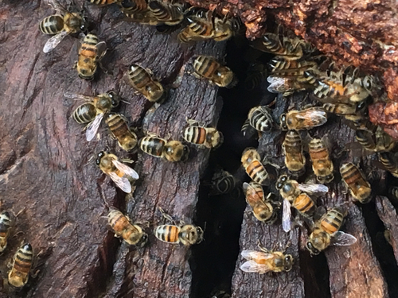
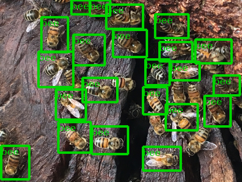

# Serverless Amazon Rekognition Custom Labels

## Introduction

This repository serves as the base for a blog post. In it, we show how to
create an object detection model using Amazon Rekognition Custom Labels,
and setup a serverless architecture to trigger inference on newly uploaded
images.

Please read through the [SECURITY_NOTES](SECURITY_NOTES.md) and [CHANGELOG](CHANGELOG.md) for important information
before using this repository

## Instructions

You will use an example dataset from the [inaturalist.org](http://inaturalist.org/) and train an Amazon Rekognition Custom Labels Object Detection model to recognise bees from RGB images.
This dataset contains 500 images of bees that have been uploaded by inaturalist users for the purposes of recording the observation and identification. We only used images that their users have licensed under [CC0](https://creativecommons.org/share-your-work/public-domain/cc0/) license.

The process of training the model is described step by step in the blog post with the use of the notebooks.

These are the high level steps for preparing our model:

1 - Access the AWS CloudFormation console and deploy the template.yaml as a new stack.

2 - Run noteboos/1_prepare_data.ipynb to download and preprocess the data into the S3 bucket.

3 - Use Amazon Rekognition Custom Labels to train an object detection model, using the manifest file of the dataset.

4 - Start the trained model, and modify the Lambda function with the model's ARN and assumed threshold.

5 - Upload a test image to the 'test_images' prefix of the bucket. Visualize results with notebooks/2_visualize_images.ipynb.

|||
| -------------- | -------------- |
|||

## Decommission resources

In order to prevent unnecessary charges after using this repository:

- Please make sure that you stop the Rekognition Custom Labels model endpoint.
- Empty the S3 bucket where data was downloaded
- Remove the stack to delete all resources generated